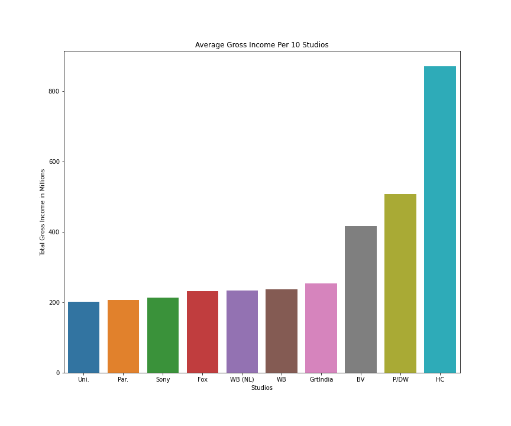

# Microsoft Movie Analysis

## Overview

Microsoft is creating a new movie studio and has hired a new data scientist to explore the movie industry. Our goal is to perform some preliminary analysis, so Microsoft can take away a few actionable insights for their new movie studio in order to create the best movies possible. Main focus of this project is to analyze the given dataset and help Microsoft to start their own successful movie studio. 

## Business Problem

Microsoft sees all the big companies creating original video content and they want to get in on the fun. They have decided to create a new movie studio, but they don’t know anything about creating movies. Our goal is to collect, clean, and analyze movie data from different sources so that we can provide recommendations to Microsoft that will allow them to be successful in the movie industry.  

## Data

In the folder zippedData are movie datasets from:

- Box Office Mojo
- IMDB
- Rotten Tomatoes
- TheMovieDB.org
- the-numbers.com

I have decided to use the following data files:

- imdb.title.basics
- imdb.title.ratings
- bom.movie_gross
- tn.movie_budgets

## Methods

Imported data and cleaned data using different methods, for example, I dropped rows with missing values and filled null values when appropriate, converted datatypes, merged multiple dataframes, created columns. After data cleaning, I utilized descriptive statistics as well as visualizations to isolate three factors of a successful movies. I used matplotlib and seaborn to visualize data.

## Results

HC, P/DW,BV are the top 3 studios with over 400 million dollars average gross income.Since profit is considered as one of the important factors, these three studios are considered to be our competitors.

Documentry, Drama and Comedy are the most successful genre with higher ratings in the past 10 years. we can also see that biography has a desirable rating along with history.

Movies released in the month of 'May' and 'June' has made higher Domestic Gross compared to other months of the year.

## Conclusions

Microsoft should research these well established studio HC,P/DW,BV to earn more gross profit and focus their efforts on the top 5 most rated movie genres: Documentry, Drama, Comedy, Biography and History to be successful. They should also consider the rating of the movie because it was given by the targeted audience. We should release a movie in the month of may and june. one major reason is it is summer and it has highest profit during those months.

## For More Information

Please review our full analysis in [our Jupyter Notebook](./Microsoft-Movie-Analysis.ipynb) 

For any additional questions, please contact Prabagini Thambinathan & email - mail4prabagini@gmail.com

